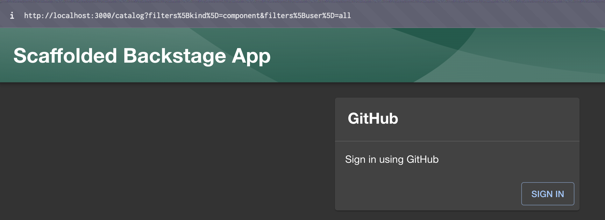
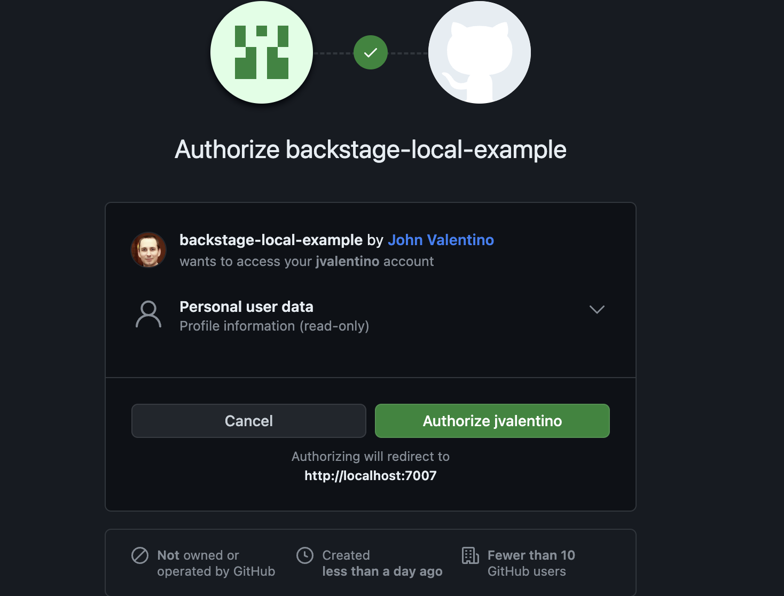
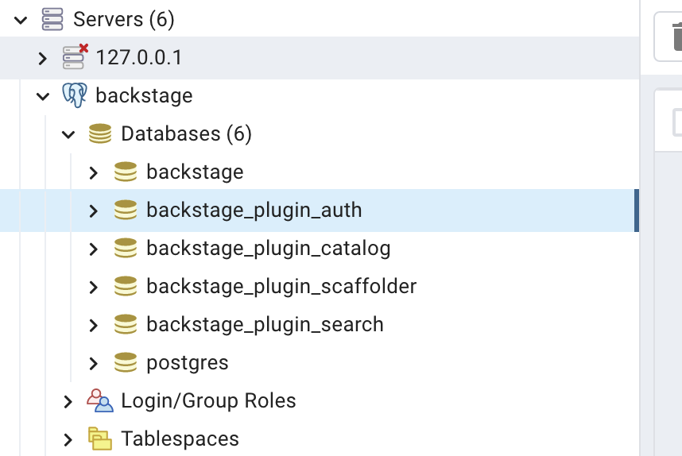
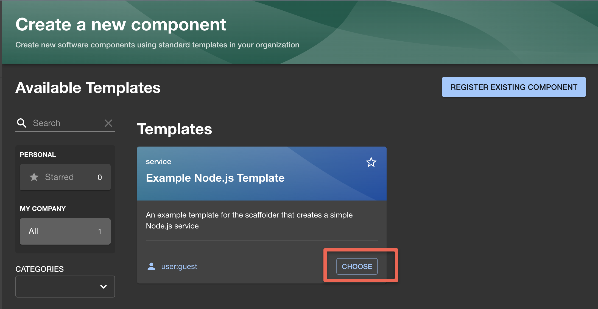
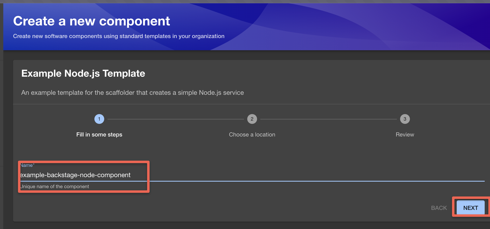
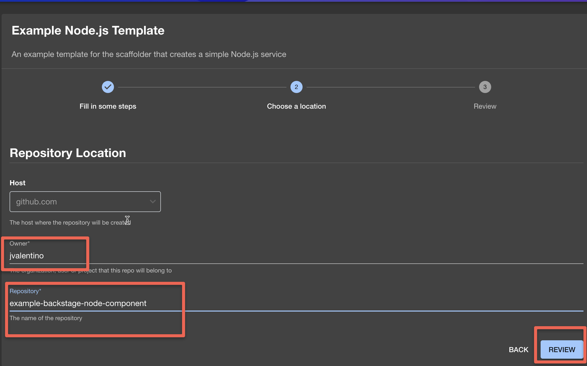
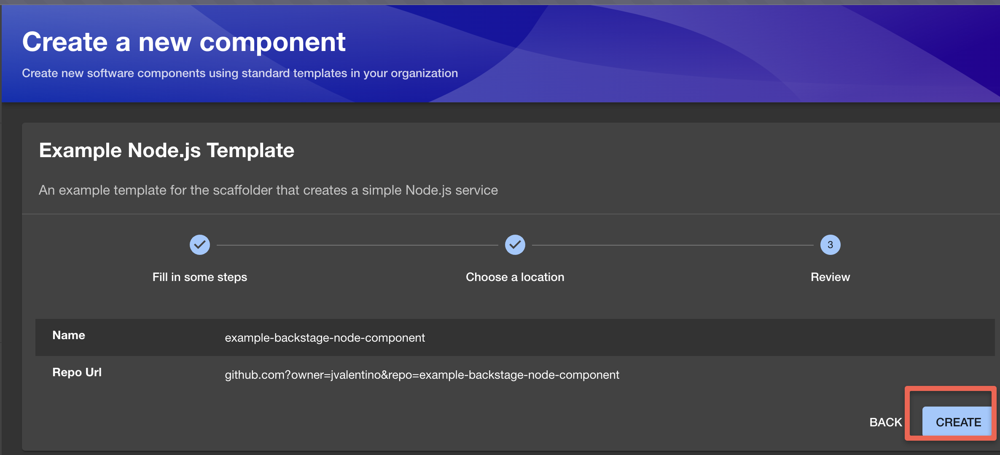
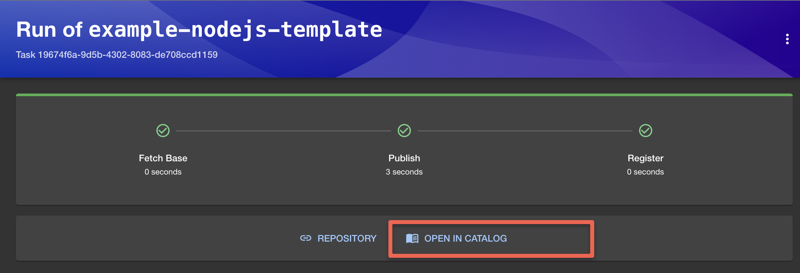
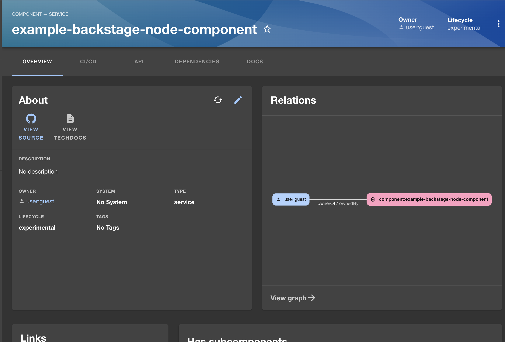
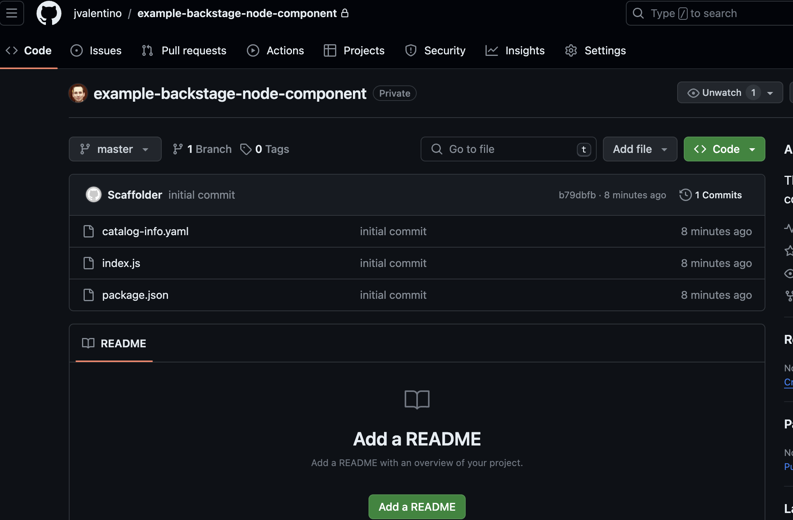

# [Backstage](https://backstage.io)


# Developer Setup


## (1) Configure the Auth provider 

Either by creating your own Github OAuth app of asking me for the credentials to mind:

Register a new auth app


Since you don't want to store these secrets in source control, set them in your profile, for example ~/.zshrc file like this

```bash
BACKSTAGE_EXAMPLE_GIT_CLIENT_ID=SOME ID
BACKSTAGE_EXAMPLE_GIT_SECRET=SOME SECRET
```

When you run the app, you will see this:





## (2) Make sure the tests work

```bash
yarn install
yarn test
```

I generally leave the test watcher on using `yarn test`, noting that getting my current version of VS Code + Jest to successfully work was a pain that I gave up on. As such I added settings to have them not run on save, which you should comment out if you got this to work:

.vscode/settings.json

```json
{
    "jest.runMode": "on-demand"
}
```

## (3) Configure the Source Code Provider

In the case of Git:

Create your Personal Access Token by opening [the GitHub token creation page](https://github.com/settings/tokens/new). Use a name to identify this token and put it in the notes field. Choose a number of days for expiration. If you have a hard time picking a number, we suggest to go for 7 days, it's a lucky number.


*Note: For mine I picked "No Expiration" so I don't have to generate a new token every 7 days.*

I then put the token in ~/.zshrc for later usage in the config:

```bash
export BACKSTAGE_EXAMPLE_GIT_TOKEN=my token
```

This environment variable is then used in the configuration file.

## (?) Run The App

To start the app, run:

```sh
yarn install
yarn dev
```


# How this project was created


## (1) Generate a template

You need to have a specific version of node installed for the setup to work so be prepared to 

```shell
brew install nvm
```

 Install the appropriate version of Node you need

```bash
nvm install 20
```

...So that you can create the new template application:

```bash
npx @backstage/create-app@latest
```

...where you will be prompted to give it an application name that will result in that directory being created.

## (2) Database Setup (Local)

 However, backstage requires a database for data storage, so from a local perspective a Postgres database container was created using docker compose:

docker-compose.yaml

```yaml
version: "3.8"
services:
  db:
    container_name: backstage-db
    image: postgres:14.1-alpine
    restart: always
    environment:
      - POSTGRES_USER=backstage
      - POSTGRES_PASSWORD=backstage
      - POSTGRES_DB=backstage
    ports:
      - "5432:5432"
    volumes:
      - ./docker-data/postgres:/var/lib/postgresql/data
```

It is further set to store the data in a directory (that is git ignored) in the project so you don't lose data locally.

This is how you run the local db

```bash
docker-compose up -d
```

You then have to add the Postgres plugin through yarn:

Reference: https://backstage.io/docs/getting-started/config/database

```bash
yarn --cwd packages/backend add pg
```

The result though is that you now have to modify app-config.yaml with the database connection information:

```yaml
backend:
  database:
    client: pg
    connection:
      host: localhost
      port: 5432
      user: backstage
      password: backstage
```

You then validate that this works using `yarn dev`, and then validating using a Postgres client that backstage schemas were created:




## (3) Authentication (Github as an Example)

Reference: https://backstage.io/docs/getting-started/config/authentication

Register a new auth app


Since you don't want to store these secrets in source control, set them in your profile, for example ~/.zshrc file like this

```bash
BACKSTAGE_EXAMPLE_GIT_CLIENT_ID=SOME ID
BACKSTAGE_EXAMPLE_GIT_SECRET=SOME SECRET
```

Update app-config.yaml with the ID and secret using their env vars:

```yaml
auth:
  # see https://backstage.io/docs/auth/ to learn about auth providers
  environment: development
  providers:
    github:
      development:
        clientId: ${BACKSTAGE_EXAMPLE_GIT_CLIENT_ID}
        clientSecret: ${BACKSTAGE_EXAMPLE_GIT_SECRET}
```

Open `packages/app/src/App.tsx` and below the last `import` line, add:

packages/app/src/App.tsx

```typescript
import { githubAuthApiRef } from '@backstage/core-plugin-api';
import { SignInPage } from '@backstage/core-components';
```

Search for `const app = createApp({` in this file, and below `apis,` add:

packages/app/src/App.tsx

```tsx
components: {
  SignInPage: props => (
    <SignInPage
      {...props}
      auto
      provider={{
        id: 'github-auth-provider',
        title: 'GitHub',
        message: 'Sign in using GitHub',
        apiRef: githubAuthApiRef,
      }}
    />
  ),
},
```


Run the app:

```
yarn dev
```

You will now see this:


## (4) Setup a Home Page

Reference: https://backstage.io/docs/getting-started/homepage

1. Install the plugin[](https://backstage.io/docs/getting-started/homepage#1-install-the-plugin)

```bash
# From your Backstage root directory
yarn --cwd packages/app add @backstage/plugin-home
```


2. Create a new HomePage component[](https://backstage.io/docs/getting-started/homepage#2-create-a-new-homepage-component)

Inside your `packages/app` directory, create a new file where our new homepage component is going to live. Create `packages/app/src/components/home/HomePage.tsx` with the following initial code

```tsx
import React from 'react';

export const HomePage = () => (
  /* We will shortly compose a pretty homepage here. */
  <h1>Welcome to Backstage!</h1>
);
```


3. Update router for the root `/` route[](https://backstage.io/docs/getting-started/homepage#3-update-router-for-the-root--route)

If you don't have a homepage already, most likely you have a redirect setup to use the Catalog homepage as a homepage.

Inside your `packages/app/src/App.tsx`, look for

packages/app/src/App.tsx

```tsx
const routes = (
  <FlatRoutes>
    <Navigate key="/" to="catalog" />
    {/* ... */}
  </FlatRoutes>
);
```


Let's replace the `<Navigate>` line and use the new component we created in the previous step as the new homepage.

packages/app/src/App.tsx

```tsx
import { HomepageCompositionRoot } from '@backstage/plugin-home';
import { HomePage } from './components/home/HomePage';

const routes = (
  <FlatRoutes>
    <Navigate key="/" to="catalog" />
    <Route path="/" element={<HomepageCompositionRoot />}>
      <HomePage />
    </Route>
    {/* ... */}
  </FlatRoutes>
);
```


4. Update sidebar items[](https://backstage.io/docs/getting-started/homepage#4-update-sidebar-items)

Let's update the route for "Home" in the Backstage sidebar to point to the new homepage. We'll also add a Sidebar item to quickly open Catalog.

| Before                                                       | After                                                        |
| ------------------------------------------------------------ | ------------------------------------------------------------ |
|  |  |

The code for the Backstage sidebar is most likely inside your [`packages/app/src/components/Root/Root.tsx`](https://github.com/backstage/backstage/blob/master/packages/app/src/components/Root/Root.tsx).

Let's make the following changes

packages/app/src/components/Root/Root.tsx

```tsx
import CategoryIcon from '@material-ui/icons/Category';

export const Root = ({ children }: PropsWithChildren<{}>) => (
  <SidebarPage>
    <Sidebar>
      <SidebarLogo />
      {/* ... */}
      <SidebarGroup label="Menu" icon={<MenuIcon />}>
        {/* Global nav, not org-specific */}
        <SidebarItem icon={HomeIcon} to="catalog" text="Home" />
        <SidebarItem icon={HomeIcon} to="/" text="Home" />
        <SidebarItem icon={CategoryIcon} to="catalog" text="Catalog" />
        <SidebarItem icon={ExtensionIcon} to="api-docs" text="APIs" />
        <SidebarItem icon={LibraryBooks} to="docs" text="Docs" />
        <SidebarItem icon={LayersIcon} to="explore" text="Explore" />
        <SidebarItem icon={CreateComponentIcon} to="create" text="Create..." />
        {/* End global nav */}
        <SidebarDivider />
        {/* ... */}
      </SidebarGroup>
    </Sidebar>
  </SidebarPage>
);
```


That's it! You should now have *(although slightly boring)* a homepage!

## (5) Avoid the "When using Node.js version 20 or newer" error

When trying to create a new component using the default configuration, you will get this error:

```
When using Node.js version 20 or newer, the scaffolder backend plugin requires that it be started with the --no-node-snapshot option. 
        Please make sure that you have NODE_OPTIONS=--no-node-snapshot in your environment.
```

To avoid this, you need to change you startup the application in package.json:

```json
...
 "scripts": {
    "dev": "concurrently \"NODE_OPTIONS='--no-node-snapshot' yarn start\" \"NODE_OPTIONS='--no-node-snapshot' yarn start-backend\"",
   ...
```


## (6) Avoid the "No token available for host: github.com" error

```
No token available for host: github.com, with owner jvalentino, and repo example-backstage-node-component
```

I guess this is what happens when you don't do this step that is a part of the auth setup: https://backstage.io/docs/getting-started/config/authentication#setting-up-a-github-integration

Create your Personal Access Token by opening [the GitHub token creation page](https://github.com/settings/tokens/new). Use a name to identify this token and put it in the notes field. Choose a number of days for expiration. If you have a hard time picking a number, we suggest to go for 7 days, it's a lucky number.


*Note: For mine I picked "No Expiration" so I don't have to generate a new token every 7 days.*

I then put the token in ~/.zshrc for later usage in the config:

```bash
exeport BACKSTAGE_EXAMPLE_GIT_TOKEN=my token
```

Set the scope to your likings. For this tutorial, selecting `repo` and `workflow` is required as the scaffolding job in this guide configures a GitHub actions workflow for the newly created project.

For this tutorial, we will be writing the token to `app-config.local.yaml`. This file might not exist for you, so if it doesn't go ahead and create it alongside the `app-config.yaml` at the root of the project. This file should also be excluded in `.gitignore`, to avoid accidental committing of this file.

In your `app-config.yaml` go ahead and add the following:

```yaml
integrations:
  github:
    - host: github.com
      # This is a Personal Access Token or PAT from GitHub. You can find out how to generate this token, and more information
      # about setting up the GitHub integration here: https://backstage.io/docs/getting-started/configuration#setting-up-a-github-integration
      token: ${BACKSTAGE_EXAMPLE_GIT_TOKEN}
```


# How does creating a new component work?















catalog-info.yaml

```yaml
apiVersion: backstage.io/v1alpha1
kind: Component
metadata:
  name: "example-backstage-node-component"
spec:
  type: service
  owner: user:guest
  lifecycle: experimental
```

This is the metadata file used for controlling the various settings on the component's page.

